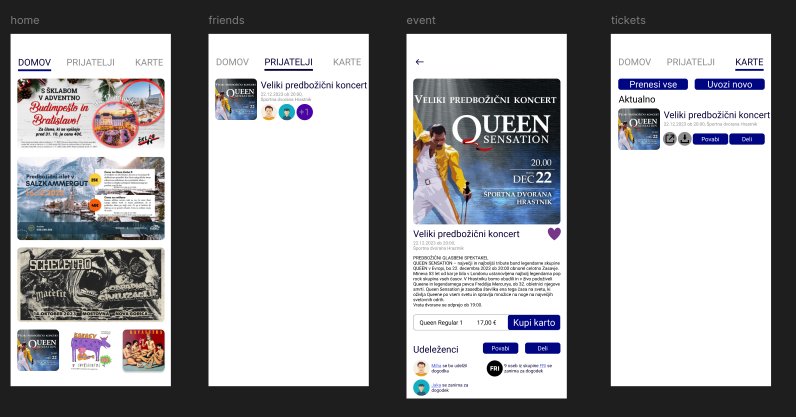

# kam? - Projektni načrt ([kam? - Razvita aplikacija](https://github.com/tibozic/kam))

  

V današnjem hitrem svetu lahko za ljudi iskanje zanimivih aktivnosti predstavlja izziv ali pa se preprosto
ne morejo odločiti, kako bi preživeli svoj prosti čas. 
Z našo aplikacijo kam? omogočamo odkrivanje lokalnih aktivnosti in usklajevanje načrtov s prijatelji. 
Naši uporabniki nikoli ne bodo zamudili zanimivih lokalnih dogodkov ali priložnosti za druženje. 
kam? je namenjen mladim odraslim osebam, ki živijo v urbanih področjih ter so družabni in vedno
iščejo nove izkušnje. 
Naša aplikacija poleg dogodkov ponuja edinstveno uporabniško izkušnjo, z elementi socialnega
omrežja, ki olajšujejo povezovanje s prijatelji. 
Na enem mestu uporabnikom ponujamo iskanje dogodkov, pregled nad interesi svojih prijateljev s
sistemom (grem/zanima me) ter nakup za določene dogodke, ki jih organizatorji ponujajo preko nas. 
Naša vizija je ustvariti platformo, kjer lahko vsak uporabnik enostavno najde pravo aktivnost zase. 
Verjamemo, da imamo vsi neizmerno bogato izbiro možnosti za preživljanje svojega prostega časa,
toda včasih je težko vedeti, kje začeti. kam? želi postati nepogrešljiv vir, kjer ljudje poiščejo navdih,
odkrijejo nove hobije, spoznajo enako misleče posameznike in si ustvarijo nepozabne spomine. Vizija
kam? je torej ustvariti okolje, kjer je vsakdo vabljen, sprejet in spoštovan ter kjer sovrstniki najdejo drug
drugega in skupaj ustvarjajo bogate pomenljive izkušnje.

## Razlaga projekta
Naš cilj je bil razviti projekt od same ideje do končne izvedbe, pri čemer smo ga spremljali skozi celoten življenjski cikel. 
Začetek je bil sproščen in kreativen – med brainstormingom smo iskali inovativne rešitve in preučevali različne možnosti. 
Ko smo se odločili za najbolj obetavno idejo, smo jo začeli obravnavati s perspektive startupa, kar nam je omogočilo razmišljanje v smeri podjetniškega razvoja.

Da bi preverili njeno tržno ustreznost, smo izvedli temeljito analizo trga, identificirali potencialne uporabnike in ocenili konkurenčno okolje. 
Hkrati smo projekt proučili tudi z ekonomskega vidika, saj smo želeli zagotoviti njegovo finančno vzdržnost in dolgoročno uspešnost. 
Na tej podlagi smo pripravili podroben projektni načrt, ki nam je služil kot smernica za nadaljnje delo.

Poleg tega smo oblikovali tudi uradni predlog projekta, v katerem smo zbrali ključne ugotovitve, cilje in načrtovane korake. 
Celoten proces smo zaključili z izdelavo proof of concept, s katerim smo praktično preverili izvedljivost naše ideje in njeno delovanje v realnem okolju. 
Tako smo uspešno zaključili razvojno pot od začetne zamisli do konkretne realizacije.

# Pridobljena znanja
- Upravljanje projektov in načrtovanje poteka dela
- Timsko delo in učinkovita komunikacija
- Reševanje problemov in prilagajanje nepričakovanim izzivom
- Kritično razmišljanje in odločanje na podlagi podatkov
- Pisanje strukturiranih in prepričljivih poročil/predlogov
- Razumevanje startup miselnosti in poslovnega modeliranja
- Tržna analiza: raziskava konkurence, ciljne skupine in tržnih trendov
- Osnove ekonomike: finančno načrtovanje, stroškovna optimizacija, ocena donosnosti
- Priprava projektnega načrta in strukturiranega predloga
- Testiranje in validacija ideje skozi proof of concept

# Datoteke
[kam_predstavitev.pdf](kam_predstavitev.pdf) - Prezentacija za površinsko predstavitev projekta 
[kam_Business_plan_quick.pdf](kam_Business_plan_quick.pdf) - Poslovni načrt z vidika Startup-a 
[kam_Business_plan_indepth.pdf](kam_Business_plan_indepth.pdf) - Poslovni načrt z ekonomskega vidika 
[kam_project_proposal.pdf](kam_project_proposal.pdf) - Predlog projekta  
[user_story.pdf](user_story.pdf) - Tabela z uporabniškimi zahtevami 
[financial_plan.pdf](financial_plan.pdf) - Tabela z financami 
[kam? Proof of concept](https://github.com/tibozic/kam) - Realizacija projekta v obliki proof of concept 

Nekatere informacije/podatki se lahko med datotekami razlikujejo zaradi tekočih sprememb med
izdelavo ter smiselnostjo pregleda iz določenega vidika.
